# Token Search Implementation Summary

## Overview
We've designed a complete solution for adding searchable token functionality to your Doubling Season app while preserving the existing manual entry feature. Users now have two ways to add tokens:
1. **Quick Search** - Select from a pre-populated database of common tokens
2. **Manual Entry** - Create custom tokens with any properties

## Architecture Diagram

```mermaid
graph TB
    subgraph "Developer Workflow"
        A[GitHub XML Repository] --> B[Fetch tokens.xml]
        B --> C[Parse XML Data]
        C --> D[Process & Clean]
        D --> E[TokenDatabase.json]
        E --> F[Bundle in App]
    end
    
    subgraph "App Architecture"
        F --> G[TokenDatabase Manager]
        G --> H[TokenSearchView]
        H --> I{User Choice}
        I -->|Select Token| J[Create Item]
        I -->|Custom Token| K[Manual Entry Alert]
        K --> J
        J --> L[SwiftData Storage]
    end
    
    subgraph "UI Flow"
        M[ContentView] --> N[+ Button]
        M --> O[🔍 Button]
        N --> K
        O --> H
    end
```



## What We've Built

### 1. **Data Processing Pipeline**
- **Data Source**: XML file from GitHub (https://github.com/Cockatrice/Magic-Token)
- **Direct URL**: https://raw.githubusercontent.com/Cockatrice/Magic-Token/master/tokens.xml
- Python/Swift scripts to fetch and parse XML data
- Converts XML token definitions to clean JSON format
- Filters out non-tokens and normalizes data
- Outputs `TokenDatabase.json` for app bundle

### 2. **Token Data Model**
- `TokenDefinition` struct for database tokens
- Search and filter capabilities
- Conversion to existing `Item` model

### 3. **Token Database Manager**
- Loads bundled JSON data
- Provides search, filter, and category functions
- Tracks recent and favorite tokens
- Persists user preferences

### 4. **Search UI**
- Full-featured search interface
- Category and color filters
- Recent and favorites tabs
- Seamless integration with manual entry

### 5. **Dual Entry System**
- Search button (🔍) opens token database
- Plus button (+) maintains manual entry
- "Create Custom Token" option in search view

## File Structure

```
Doubling Season/
├── Models/
│   ├── Item.swift (existing)
│   ├── Deck.swift (existing)
│   ├── TokenDefinition.swift (NEW)
│   └── TokenDatabase.swift (NEW)
├── Views/
│   ├── ContentView.swift (modified)
│   ├── TokenView.swift (existing)
│   ├── TokenSearchView.swift (NEW)
│   └── TokenSearchRow.swift (NEW)
├── Resources/
│   └── TokenDatabase.json (NEW)
└── Scripts/ (developer tools, not in app)
    ├── process_tokens_xml.py
    ├── update_tokens.sh
    └── xml_token_processing_scripts.md
```

## Implementation Steps for Developer

### Step 1: Process Your Token Data
```bash
# Fetch and process XML from GitHub (Python)
python3 process_tokens_xml.py

# Or using Swift script
swift process_tokens_xml.swift

# The scripts automatically:
# 1. Fetch tokens.xml from GitHub
# 2. Parse XML structure
# 3. Extract and clean token data
# 4. Generate TokenDatabase.json
```

### Step 2: Add Files to Xcode Project
1. Create new Swift files:
   - `TokenDefinition.swift`
   - `TokenDatabase.swift` (combine with TokenDefinition if preferred)
   - `TokenSearchView.swift`

2. Add `TokenDatabase.json` to project:
   - Drag into Xcode
   - Ensure "Copy items if needed" is checked
   - Add to target membership

### Step 3: Modify ContentView
```swift
// Add to ContentView.swift
@State private var isShowingTokenSearch = false

// In toolbar, modify the search button action:
ToolbarItem {
    Button(action: { isShowingTokenSearch = true }) {
        Label("Search", systemImage: "plus.magnifyingglass")
    }
}

// Add sheet modifier:
.sheet(isPresented: $isShowingTokenSearch) {
    TokenSearchView(showManualEntry: $isShowingNewTokenAlert)
        .presentationDetents([.large])
}
```

### Step 4: Test Both Entry Methods
1. Verify manual entry still works (+ button)
2. Test search functionality (🔍 button)
3. Confirm "Create Custom Token" links back to manual entry
4. Test token creation from search results

## Key Features

### Search & Filter
- **Text Search**: Name, abilities, type
- **Category Filter**: Creature, Artifact, Enchantment, etc.
- **Color Filter**: W, U, B, R, G, Colorless
- **Recent Tokens**: Last 10 used tokens
- **Favorites**: Star tokens for quick access

### User Experience
- **Instant Search**: Real-time filtering as you type
- **Visual Indicators**: Color dots for mana colors
- **Power/Toughness Badge**: Clear P/T display
- **Ability Preview**: First 2 lines shown in list
- **Quantity Dialog**: Same as manual entry (amount, tapped/untapped)

### Performance
- **Lazy Loading**: Tokens loaded in background
- **Efficient Search**: In-memory filtering
- **Cached Preferences**: Recent/favorites persist

## Updating Token Database

### Regular Updates
1. Run processing script (automatically fetches from GitHub)
2. Script generates updated `TokenDatabase.json`
3. Replace file in Xcode project
4. Build and deploy app update

### Automated Workflow
```bash
#!/bin/bash
# update_and_deploy.sh

# Fetch latest tokens from GitHub and process
./update_tokens.sh

# The script will:
# - Download tokens.xml from GitHub
# - Parse XML and extract tokens
# - Generate TokenDatabase.json
# - Copy to project directory

# Open Xcode project
open "Doubling Season.xcodeproj"

# Reminder
echo "Don't forget to:"
echo "1. Test the updated database"
echo "2. Increment version number"
echo "3. Archive and upload to App Store"
```

## Benefits Achieved

### For Users
✅ **Speed** - Add common tokens instantly  
✅ **Accuracy** - No typos in token stats  
✅ **Discovery** - Browse available tokens  
✅ **Flexibility** - Custom tokens still possible  
✅ **Convenience** - Recent and favorites for quick access  

### For Developer
✅ **Maintainable** - Clean separation of concerns  
✅ **Updatable** - Easy to refresh token database  
✅ **Extensible** - Can add more features (images, etc.)  
✅ **Compatible** - Works with existing code  

## Testing Checklist

Before deployment, verify:

- [ ] Manual token entry works (+ button)
- [ ] Search opens token database (🔍 button)
- [ ] Search filters tokens correctly
- [ ] Category filters work
- [ ] Color filters work
- [ ] Recent tokens are tracked
- [ ] Favorites can be added/removed
- [ ] Token selection shows quantity dialog
- [ ] Tokens are created with correct properties
- [ ] "Create Custom Token" returns to manual entry
- [ ] App performs well with full database
- [ ] TokenDatabase.json is included in bundle

## Potential Enhancements

### Phase 2 Ideas
- **Token Images**: Add card artwork
- **Advanced Search**: Regular expressions, multiple criteria
- **Cloud Sync**: Sync favorites across devices
- **Token Sets**: Group tokens by expansion
- **Statistics**: Most used tokens, deck analytics

### Phase 3 Ideas
- **Online Updates**: Download new tokens without app update
- **Community Tokens**: User-submitted custom tokens
- **Token Builder**: Visual token creator
- **Export/Import**: Share token lists

## Troubleshooting

### Common Issues

**Tokens not loading:**
- Check `TokenDatabase.json` is in bundle
- Verify JSON format is valid
- Check file is added to target

**Search not working:**
- Ensure `searchableText` computed property is correct
- Check search implementation in `TokenDatabase`

**Manual entry broken:**
- Verify `isShowingNewTokenAlert` still triggers
- Check alert hasn't been removed from ContentView

**Performance issues:**
- Consider pagination for large databases
- Implement lazy loading in List
- Cache search results

## Summary

You now have a complete implementation plan for adding searchable token functionality to your app. The solution:

1. **Preserves existing functionality** - Manual entry remains unchanged
2. **Adds powerful search** - Quick access to common tokens  
3. **Enhances user experience** - Multiple ways to find tokens
4. **Maintains simplicity** - Clean, intuitive interface
5. **Enables future growth** - Extensible architecture

The implementation is ready to be coded. Would you like me to switch to code mode to help implement these features, or would you prefer to review and adjust the plan first?