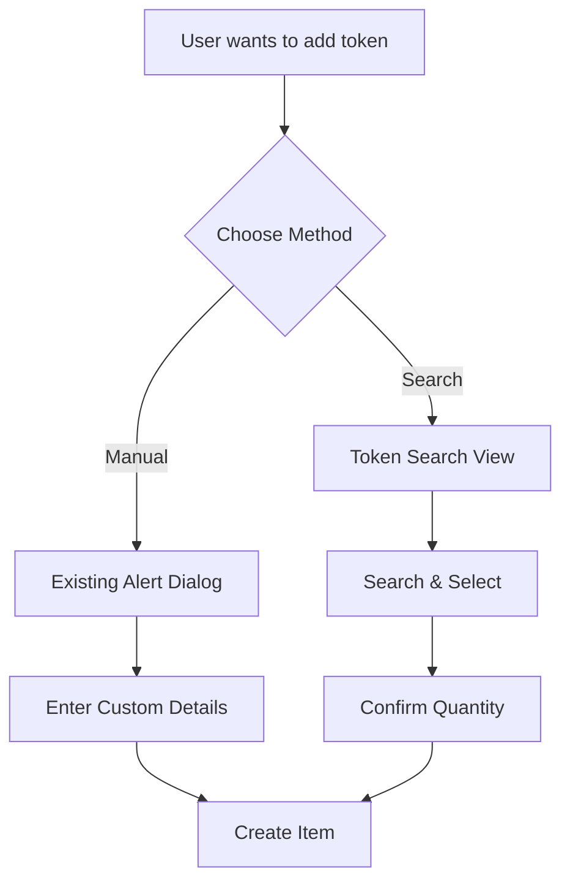
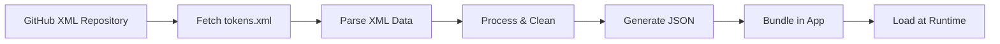
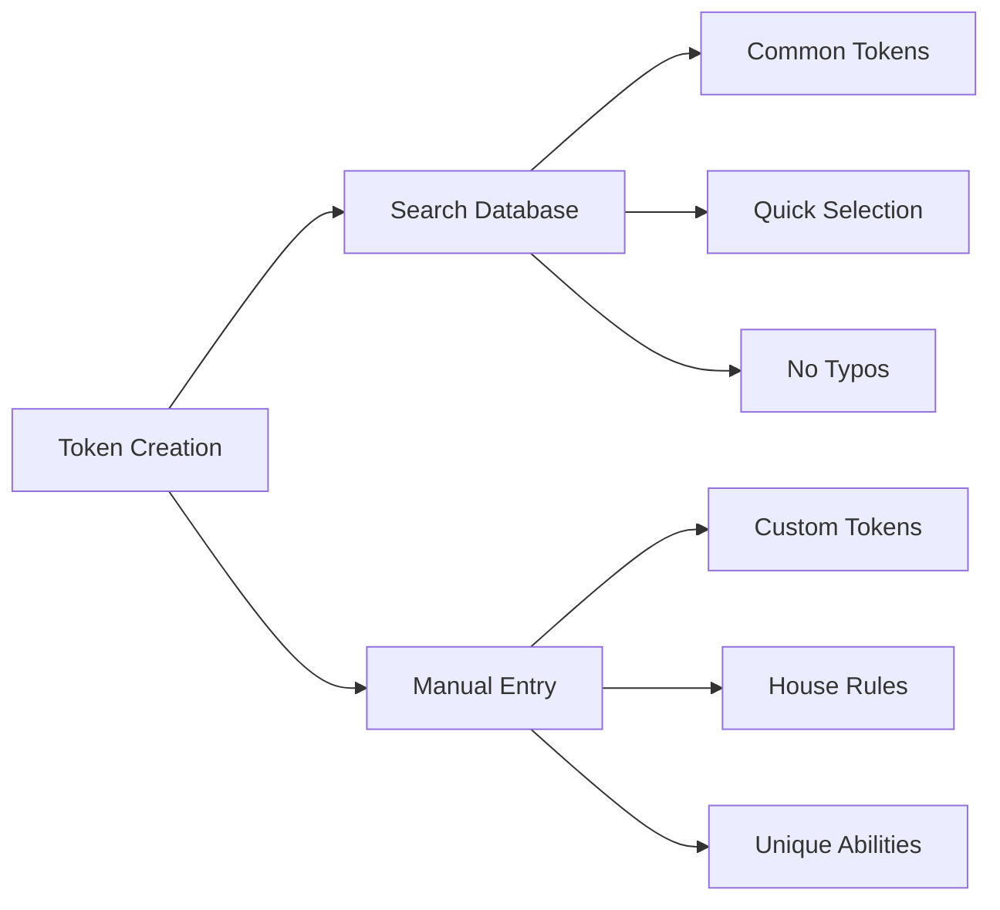

# Token Search Implementation Plan

## Overview
Add a searchable token database feature to complement the existing manual token creation, giving users the choice between quick selection from a pre-defined list OR custom manual entry for unique tokens.

## Current State Analysis
- **App Structure**: SwiftUI app with SwiftData for persistence
- **Token Model**: `Item` class with properties: name, abilities, pt, colors, amount, tapped
- **Current Flow**: Users manually enter token details via alert dialog (KEEP THIS)
- **Goal**: ADD searchable token database as an additional option

## Implementation Architecture

### User Flow Diagram



### 1. Data Pipeline (Developer Side)



#### Data Source
- **Repository**: https://github.com/Cockatrice/Magic-Token
- **File**: tokens.xml
- **Direct URL**: https://raw.githubusercontent.com/Cockatrice/Magic-Token/master/tokens.xml
- **Format**: XML with comprehensive token definitions
- **Maintained by**: Cockatrice community (regularly updated)

#### Processing Script Overview
```python
# Fetch XML directly from GitHub
url = "https://raw.githubusercontent.com/Cockatrice/Magic-Token/master/tokens.xml"
xml_data = fetch_from_github(url)

# Parse XML structure
tokens = parse_xml_tokens(xml_data)

# Clean and normalize
processed_tokens = process_tokens(tokens)

# Export to JSON for iOS app
export_to_json(processed_tokens, "TokenDatabase.json")
```

The processing script:
1. Fetches the latest tokens.xml from GitHub
2. Parses XML structure to extract token data
3. Filters out non-token cards
4. Normalizes colors to WUBRG format
5. Cleans ability text
6. Exports to JSON format for the iOS app

### 2. Token Database Structure

```swift
// TokenDatabase.swift
struct TokenDefinition: Codable, Identifiable, Hashable {
    let id: UUID = UUID()
    let name: String
    let abilities: String
    let pt: String
    let colors: String
    let type: String
    
    // For search functionality
    var searchableText: String {
        "\(name.lowercased()) \(abilities.lowercased()) \(type.lowercased())"
    }
}

class TokenDatabase: ObservableObject {
    @Published var tokens: [TokenDefinition] = []
    @Published var filteredTokens: [TokenDefinition] = []
    
    init() {
        loadTokens()
    }
    
    func loadTokens() {
        guard let url = Bundle.main.url(forResource: "TokenDatabase", withExtension: "json"),
              let data = try? Data(contentsOf: url),
              let decoded = try? JSONDecoder().decode([TokenDefinition].self, from: data) else {
            return
        }
        tokens = decoded
        filteredTokens = decoded
    }
    
    func search(query: String) {
        if query.isEmpty {
            filteredTokens = tokens
        } else {
            filteredTokens = tokens.filter { token in
                token.searchableText.contains(query.lowercased())
            }
        }
    }
}
```

### 3. Search UI Implementation

```swift
// TokenSearchView.swift
struct TokenSearchView: View {
    @StateObject private var database = TokenDatabase()
    @State private var searchText = ""
    @State private var selectedToken: TokenDefinition?
    @State private var showQuantityAlert = false
    @State private var tempAmount = ""
    @State private var createTapped = false
    @Environment(\.dismiss) private var dismiss
    @Environment(\.modelContext) private var modelContext
    
    var body: some View {
        NavigationStack {
            VStack {
                // Search results
                List(database.filteredTokens) { token in
                    TokenSearchRow(token: token)
                        .onTapGesture {
                            selectedToken = token
                            showQuantityAlert = true
                        }
                }
                .searchable(text: $searchText, prompt: "Search tokens...")
                .onChange(of: searchText) { _, newValue in
                    database.search(query: newValue)
                }
                
                // Manual entry option at bottom
                Divider()
                Button(action: {
                    dismiss()
                    // This will trigger the existing manual entry alert
                }) {
                    Label("Create Custom Token", systemImage: "plus.circle")
                        .frame(maxWidth: .infinity)
                        .padding()
                }
            }
            .navigationTitle("Add Token")
            .toolbar {
                ToolbarItem(placement: .cancellationAction) {
                    Button("Cancel") {
                        dismiss()
                    }
                }
            }
            .alert("How many \(selectedToken?.name ?? "")?", isPresented: $showQuantityAlert) {
                TextField("Amount", text: $tempAmount)
                    .keyboardType(.numberPad)
                
                Button("Create") {
                    if let token = selectedToken {
                        createTokenFromDatabase(token, tapped: false)
                    }
                }
                
                Button("Create Tapped") {
                    if let token = selectedToken {
                        createTokenFromDatabase(token, tapped: true)
                    }
                }
                
                Button("Cancel", role: .cancel) {
                    tempAmount = ""
                }
            }
        }
    }
    
    private func createTokenFromDatabase(_ token: TokenDefinition, tapped: Bool) {
        let amount = Int(tempAmount) ?? 1
        let newItem = Item(
            abilities: token.abilities,
            name: token.name,
            pt: token.pt,
            colors: token.colors,
            amount: amount,
            createTapped: tapped
        )
        modelContext.insert(newItem)
        dismiss()
    }
}

struct TokenSearchRow: View {
    let token: TokenDefinition
    
    var body: some View {
        VStack(alignment: .leading, spacing: 4) {
            HStack {
                Text(token.name)
                    .font(.headline)
                Spacer()
                Text(token.pt)
                    .font(.caption)
                    .foregroundColor(.secondary)
            }
            
            if !token.abilities.isEmpty {
                Text(token.abilities)
                    .font(.caption)
                    .foregroundColor(.secondary)
                    .lineLimit(2)
            }
            
            HStack {
                ForEach(Array(token.colors), id: \.self) { color in
                    Circle()
                        .fill(colorForMana(color))
                        .frame(width: 16, height: 16)
                }
                Spacer()
            }
        }
        .padding(.vertical, 4)
    }
    
    func colorForMana(_ mana: Character) -> Color {
        switch mana {
        case "W": return .yellow
        case "U": return .blue
        case "B": return .purple
        case "R": return .red
        case "G": return .green
        default: return .gray
        }
    }
}
```

### 4. Integration with ContentView (Modified)

```swift
// Modified ContentView.swift - KEEP ALL EXISTING FUNCTIONALITY
struct ContentView: View {
    // ... ALL existing properties ...
    @State private var isShowingNewTokenAlert = false  // KEEP THIS
    @State private var isShowingTokenSearch = false    // Already exists!
    
    var body: some View {
        NavigationStack {
            // ... existing list ...
            .toolbar {
                // ... ALL existing toolbar items ...
                
                // KEEP the manual add button
                ToolbarItem {
                    Button(action: { isShowingNewTokenAlert = true }) {
                        Label("Add Item", systemImage: "plus")
                    }
                }
                
                // MODIFY the search button to show TokenSearchView
                ToolbarItem {
                    Button(action: { isShowingTokenSearch = true }) {
                        Label("Search", systemImage: "plus.magnifyingglass")
                    }
                }
            }
            // KEEP the existing manual entry alert
            .alert("New Token", isPresented: $isShowingNewTokenAlert) {
                // ... existing manual entry fields ...
            }
            // ADD sheet for token search
            .sheet(isPresented: $isShowingTokenSearch) {
                TokenSearchView()
                    .presentationDetents([.large])
            }
        }
    }
    
    // KEEP ALL existing functions unchanged
}
```

### 5. Dual Entry System Benefits



### 6. Data Update Workflow

```bash
#!/bin/bash
# update_tokens.sh

# Fetch latest XML from GitHub
echo "Fetching tokens.xml from GitHub..."
curl -L -o tokens.xml "https://raw.githubusercontent.com/Cockatrice/Magic-Token/master/tokens.xml"

# Process XML to JSON
echo "Processing XML data..."
python3 process_tokens_xml.py

# Copy to Xcode project
cp TokenDatabase.json "Doubling Season/TokenDatabase.json"

echo "✅ Token database updated from GitHub!"
```

#### Alternative: Direct Processing (No Local XML)
```python
# The script can fetch and process in one step
# without saving the XML locally
import urllib.request
import xml.etree.ElementTree as ET

url = "https://raw.githubusercontent.com/Cockatrice/Magic-Token/master/tokens.xml"
with urllib.request.urlopen(url) as response:
    xml_content = response.read()
    # Process directly...
```

## Implementation Steps

### Phase 1: Data Preparation
1. Create XML parsing script for tokens.xml from GitHub
2. Implement direct fetch from GitHub repository
3. Parse XML structure and extract token elements
4. Filter for actual tokens (check type and name fields)
5. Clean and normalize data fields (colors, abilities, P/T)
6. Generate TokenDatabase.json for iOS app

### Phase 2: Database Integration
1. Add TokenDatabase.swift to project
2. Bundle TokenDatabase.json in app resources
3. Implement TokenDefinition model
4. Create TokenDatabase manager class

### Phase 3: Search UI
1. Create TokenSearchView with search functionality
2. Add "Create Custom Token" button that dismisses to manual entry
3. Implement quantity alert for selected tokens
4. Design token row display with colors

### Phase 4: Integration
1. Modify search button to show TokenSearchView
2. Keep manual "+" button unchanged
3. Ensure both methods work seamlessly
4. Test token creation from both paths

### Phase 5: Polish
1. Add recently used tokens section
2. Implement favorites/bookmarks
3. Add token categories (creature types)
4. Cache search results
5. Add haptic feedback on selection

## File Structure
```
Doubling Season/
├── Models/
│   ├── Item.swift (existing - unchanged)
│   ├── TokenDefinition.swift (new)
│   └── TokenDatabase.swift (new)
├── Views/
│   ├── ContentView.swift (minimal modifications)
│   ├── TokenView.swift (existing - unchanged)
│   ├── TokenSearchView.swift (new)
│   └── TokenSearchRow.swift (new)
├── Resources/
│   └── TokenDatabase.json (new, bundled)
└── Scripts/
    ├── process_tokens_xml.py (XML parser for GitHub data)
    ├── update_tokens.sh (fetch and process workflow)
    └── xml_token_processing_scripts.md (documentation)
```

## User Benefits
- **Choice**: Users can choose quick selection OR custom entry
- **Speed**: Common tokens added instantly
- **Flexibility**: Custom tokens for house rules/variants
- **Accuracy**: Pre-defined tokens have correct stats
- **Discovery**: Browse available tokens
- **Convenience**: Best of both worlds

## Technical Considerations
- **App Size**: TokenDatabase.json adds ~500KB-2MB
- **Data Source**: GitHub repository (no API keys needed)
- **Network**: Initial fetch requires internet connection
- **Backwards Compatible**: Existing functionality unchanged
- **Performance**: Lazy loading for search results
- **Memory**: Token database loaded once, cached
- **Updates**: Can fetch latest data anytime from GitHub
- **Reliability**: GitHub raw content CDN is highly available

## Example User Scenarios

### Scenario 1: Common Token
1. User taps search button (magnifying glass)
2. Types "soldier"
3. Sees list of soldier tokens
4. Taps "Soldier 1/1 W"
5. Enters quantity: 5
6. Token created

### Scenario 2: Custom Token
1. User taps add button (+)
2. Manually enters custom token details
3. Creates unique token not in database

### Scenario 3: Browse First, Then Custom
1. User searches database
2. Doesn't find what they need
3. Taps "Create Custom Token"
4. Returns to manual entry flow

## Summary
This implementation adds a powerful search feature while preserving the essential manual entry functionality. Users get the best of both worlds: quick access to common tokens and full flexibility for custom creations.