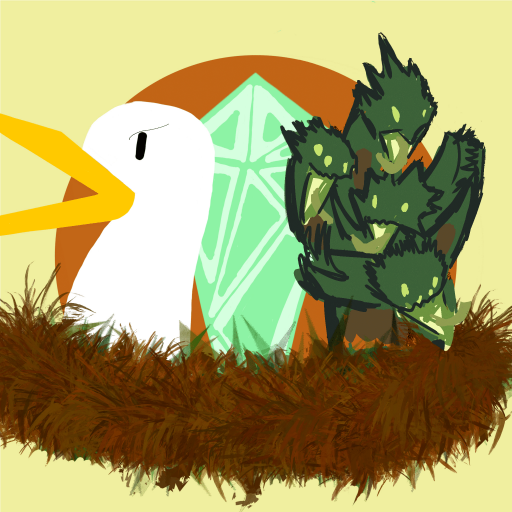
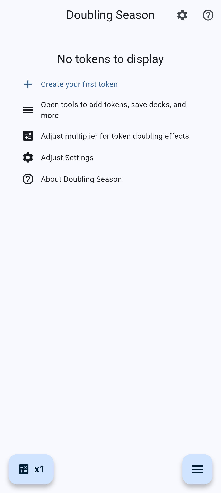
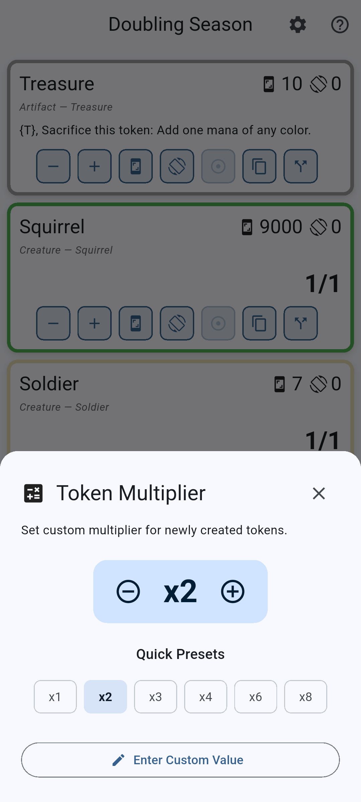
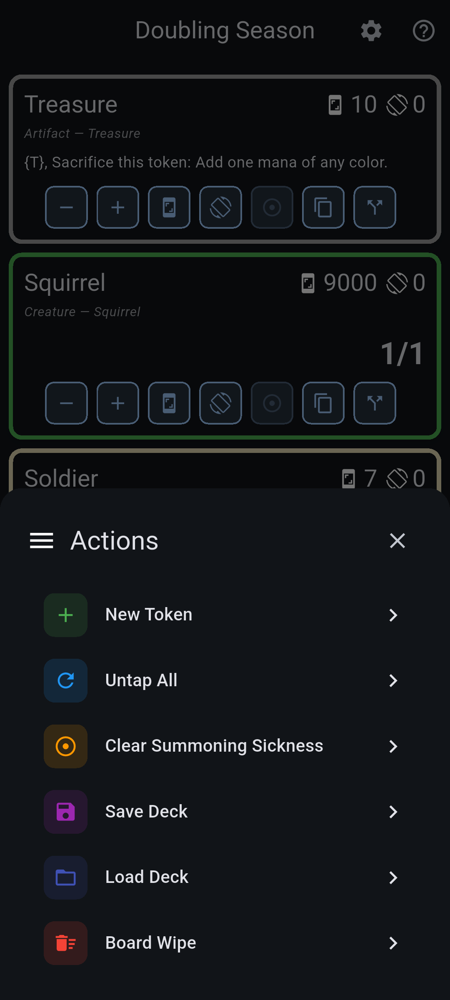

# Doubling Season

  
  
  **The ultimate token tracker for Magic: The Gathering**
  
  
  
  

---

## What is Doubling Season?

Doubling Season is a powerful, intuitive app designed to help Magic: The Gathering players track their tokens during gameplay. Whether you're running a token-heavy Commander deck or just need to keep track of a few creature tokens, Doubling Season makes it effortless.

Stop fumbling with dice, paper, or physical token cards. Doubling Season gives you a clean, digital solution that's always in your pocket.

## ✨ Features

### 🎴 Comprehensive Token Database
- **300+ official tokens and emmblems** 
- Easily search by name, type, or color identity
- Create custom tokens for unique situations

### 🎯 Smart Token Management
- **Tap/Untap tracking** - Visual indicators for tapped tokens
- **Summoning sickness** - Toggle to track newly created tokens
- **Stack splitting** - Divide token stacks while preserving counters
- **Token multiplier** - Track token doubling effects like Doubling Season

### 📊 Counter System
- **+1/+1 and -1/-1 counters** with automatic cancellation
- **Custom counter types** - Shield, Energy, Poison, and more
- **Per-pile or per-token** counter management
- Visual counter pills for at-a-glance tracking

### 💾 Deck Management
- **Save deck configurations** - Store a list of tokens to reuse
- **Quick load** - Instantly recreate your board state

### 🎨 Clean Interface
- **Color-coded borders** - Tokens display their color identity (WUBRG)
- **Compact card view** - See all your tokens at once
- **Detailed editor** - Tap any token for full editing capabilities
- **Dark mode support** - Easy on the eyes during long games

### ⚡ Special Features
- **Board wipe** - Clear all tokens with one tap
- **Untap all** - Reset for your next turn
- **Scute Swarm support** - Special doubling button for landfall triggers
- **Emblem tracking** - Dedicated handling for emblems

## 📱 Screenshots

  
  
  
  

## 🚀 Get Started

### Download the App

**iOS (iPhone & iPad)**  
[Download on the App Store](https://apps.apple.com/app/doubling-season)

**Android**  
[Get it on Google Play](https://play.google.com/store/apps/details?id=com.loosetie.doublingseason)

### Quick Start Guide

1. **Create your first token**
   - Tap the **+** button in the bottom-right corner
   - Search for a token by name (e.g., "Goblin", "Treasure", "Soldier")
   - Select the token and choose quantity
   - Your token appears on the board!

2. **Manage your tokens**
   - **Tap** a token card to view details and edit properties
   - Use **+/−** buttons to adjust token counts
   - Tap the **sword icon** to tap/untap tokens
   - Long-press for bulk operations

3. **Add counters**
   - Open a token's detail view
   - Use the counter buttons to add +1/+1 or -1/-1 counters
   - Tap **"Add Counter"** for custom counter types
   - Counters automatically update power/toughness display

4. **Save your setup**
   - Tap the **menu** button (three dots)
   - Select **"Save Deck"**
   - Name your configuration
   - Load it anytime with **"Load Deck"**

## 🎮 Perfect For

- **Commander/EDH players** with token-heavy strategies
- **Limited players** tracking multiple creature tokens
- **Combo decks** that create large numbers of tokens
- **Anyone** who wants a cleaner alternative to physical tokens

## 🛠️ Built With

- **Flutter** - Cross-platform framework for iOS and Android
- **Hive** - Fast, local database for offline functionality

## 📄 License & Credits

Doubling Season is unofficial Fan Content permitted under the Fan Content Policy. Not approved/endorsed by Wizards of the Coast. Portions of the materials used are property of Wizards of the Coast. © Wizards of the Coast LLC.

Token database sourced from the [Cockatrice project](https://github.com/Cockatrice/Magic-Token).

## 🤝 Support & Feedback

Found a bug? Have a feature request? 

- **Website**: [didymusbenson.github.io/Doubling-Season](https://didymusbenson.github.io/Doubling-Season/)
- **Issues**: [GitHub Issues](https://github.com/didymusbenson/Doubling-Season/issues)
- **Email**: Contact through the app's About screen

---

  Made with ❤️ for the Magic: The Gathering community
  
  **Download now and never lose track of your tokens again!**

